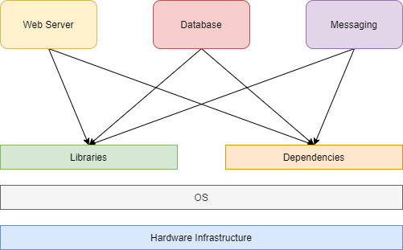
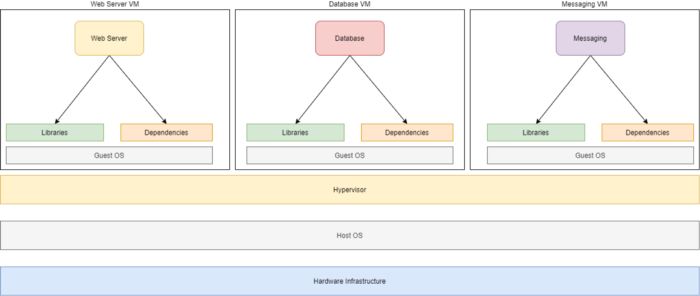
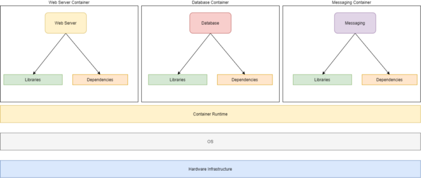
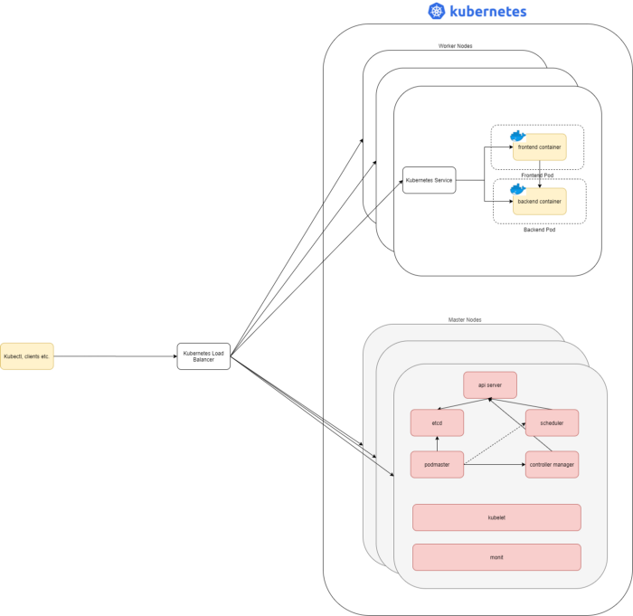

Before starting with the technical jargon related to K8s, I would like to redirect y'all to [this post](https://www.linkedin.com/posts/stevenouri_mlops-devops-activity-6857456996527022080-TBeF) which explains the usecase of kubernetes.

Hope y'all now have a basic understanding of what it does. So, now let's move to some technical terminologies.

### What is Kubernetes(or simply K8s)?

Kubernetes is an open-source container-orchestration system for automating application deployment, scaling, and management.

There are two main words here: *container* and *orchestration*. We need to understand what each one is to understand Kubernetes.

### What are Containers?

Containers are a technology for packaging the (compiled) code for an application along with the dependencies it needs at run time. Each container that you run is repeatable; the standardisation from having dependencies included means that you get the same behaviour wherever you run it.

Pretty Complicated right? Let me explain it.

If we need to spin up a stack of applications in a server, such as a web application, database, messaging layer, etc., this will result in the following scenario.

There is a hardware infrastructure on which an operating system (OS) runs, and libraries and application dependencies are installed over the OS. Different applications then share the same libraries and dependencies to run.

If you look into the design described, there are bound to be multiple problems. If you’ve rightly guessed, a web server might need a different version of a library as compared to the database server, for example, and one version of dependency can be compatible with one application but incompatible with another. If we need to upgrade one of the dependencies, we need to ensure that we do not impact another application that might not support it. This scenario is known as the Matrix of Hell and is a nightmare for developers and admins alike.

#### Solutions 1:

**Virtual Machines (VMs):**

A virtual machine is an emulation of a computer system. Virtual machines are based on computer architectures and provide the functionality of a physical computer using software called a hypervisor. Some of the popular hypervisors in the market are VMWare and Oracle Virtual Box. A typical VM-based stack looks like this:

We have resolved the dependency problem, and now we are out of the Matrix of Hell. However, this introduces another issue. Instead of running a single OS within a machine, we now have multiple guest OSs running within a physical device.

#### Solutions 2:

Containers balance the problem out by treating servers as servers. We no longer have a separate VM for the webserver, database, and messaging. Instead, we have different containers for them.

We have now got rid of the guest OS dependency, and containers now run as separate processes within the same OS. Containers make use of container runtimes. One of the famous container runtimes is Docker. I won't be talking about Docker here as it is a big concept in itself, however attaching a [post](https://www.linkedin.com/posts/stevenouri_buildwithai-programming-activity-6857289563795279872-ol7s?utm_source=linkedin_share&utm_medium=member_desktop_web) which gives a quick overview.

The idea of having multiple containers running within a server sounds tempting, but they come with their own set of problems. How you scale containers? How do you ensure that containers run and heal when they are unhealthy? What would happen if you suddenly see a spike and want to scale up your containers automatically? and many more...

Now this is where K8s comes to rescue.

### Container Orchestration Using Kubernetes

The idea of using Kubernetes is simple. You have a cluster of servers that are managed by Kubernetes, and Kubernetes is responsible for orchestrating your containers within the servers. You treat servers as servers, and you run applications within self-contained units called containers.

Since containers can run the same in any server, it does not matter on what server your container is running, as long as the client can reach it. If you need to scale your cluster, you can add or remove nodes to the cluster without worrying about the application architecture, zoning, roles, etc. You handle all of these at the Kubernetes level.

Kubernetes uses a simple concept to manage containers. There are master nodes (control plane) which control and orchestrate the container workloads, and the worker nodes where the containers run. Kubernetes run containers in pods, which form the basic building block in Kubernetes.

Following is a high-level architecture of a Kubernetes cluster:

Feel free to read more about the K8s architecture [here](https://avinetworks.com/glossary/kubernetes-architecture/#:~:text=Basic%20Kubernetes%20architecture%20exists%20in,which%20are%20composed%20of%20containers.)

Know more about this concept through these documentries - [Part1](https://youtu.be/BE77h7dmoQU) and [Part2](https://youtu.be/318elIq37PE)